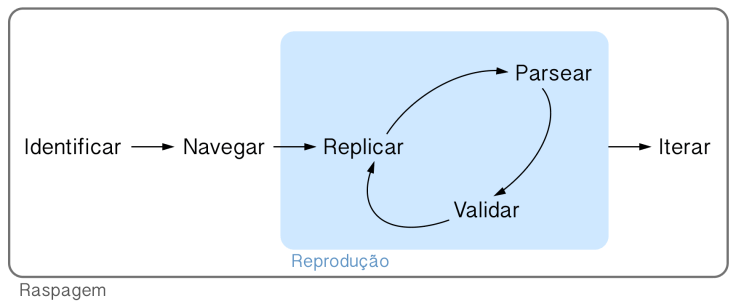

```{r setup, include=FALSE}
knitr::opts_chunk$set(
  fig.align = "center",
  echo = FALSE
)
```


class: middle, center

# Introdução

---
# O que é web scraping?

- Envolve acessar, baixar e organizar dados provenientes da web.

- É o "terceiro braço" de pessoas que trabalham com ciência de dados.

- Em português, "raspagem de dados".

- Não confundir com web crawling.

---
# Por que web scraping?

**Tudo o que você vê na internet pode se transformar dados para analisar!**

```{r}
knitr::include_graphics("img/matrix.gif")
```

---

# Política do web scraping

## Quando usar

- Quando precisamos coletar um volume grande de dados da internet

## Quando não usar

- Existem formas mais simples de obter os dados (API, base de dados, etc.)

- Os termos de uso do site não nos permitem fazer isso.

- As informações do site não são públicas.

---

# Cuidados

- Risco de derrubar ou comprometer a estabilidade do site.

- Vale à pena conversar com a entidade detentora dos dados.

```{r}
knitr::include_graphics("img/spiderman.gif")
```

---

# Fluxo do Web Scraping 

```{r fluxo-ws}

```

---


# Tipos de problemas

- **APIs disponíveis**: O site fornece uma forma estruturada e documentada para acessar as páginas (com ou sem necessidade de fazer login).

- **APIs escondidas**: O site não fornece uma forma estruturada e documentada para acessar as páginas, mas internamente é alimentado por uma API não documentada, que podemos descobrir e usar.

- **HTML estático**: O site não fornece uma forma estruturada de acessar as páginas, e as páginas são geradas de forma estática (carregam sem necessidade de usar um navegador).

- **HTML dinâmico**: O site não fornece uma forma estruturada de acessar as páginas, e as páginas são geradas de forma dinâmica.

- ...

---
class: center, middle

# APIs

---

# O que é API?

- *Application Programming Interface*.

- É uma forma unificada para acessar dados de uma plataforma, a partir de qualquer linguagem de programação.

- Facilita a vida da pessoa que programa.

- Geralmente vem acompanhada de documentação.

- Reduz o volume na transferência de dados

---

# Como funciona uma API?

.pull-left[

#### 1. Acessar

- Instruções de acesso na **documentação** da API.
- Geralmente envolve obter um **token** de acesso, que funciona como uma senha.

#### 2. Coletar

- Geralmente são requisições do tipo **GET**.
- Pode ou não possuir parâmetros para acessar as informações.
- O resultado geralmente vem num arquivo **json**.

]

.pull-right[

#### 3. Inserir

- Geralmente são requisições do tipo **POST**.
- Necessariamente possui parâmetros para enviar informações ao servidor.

#### Pacotes

- Utilizar pacote `{httr}`.

]

---

# Exemplo 01: Poke API

Veja aqui: https://brasilapi.com.br

```{r, echo=TRUE, eval=FALSE}
url_base <- "https://brasilapi.com.br/api" 
endpoint <- "/cep/v1/68980000"            
u_brasilapi <- paste0(url_base, endpoint) 
httr::GET(u_brasilapi)
```

      Response [https://brasilapi.com.br/api/cep/v1/68980000]
        Date: 2022-02-02 20:09
        Status: 200
        Content-Type: application/json; charset=utf-8
        Size: 98 B
      
---

# Exemplo 01: Brasil API

Veja aqui: https://brasilapi.com.br

```{r, echo=TRUE, eval=FALSE}
url_base <- "https://brasilapi.com.br/api"
endpoint <- "/cep/v1/68980000"            
u_brasilapi <- paste0(url_base, endpoint) 
httr::GET(u_brasilapi)
```

    * Response [https://brasilapi.com.br/api/cep/v1/68980000]
        Date: 2022-02-02 20:09
        Status: 200
        Content-Type: application/json; charset=utf-8
        Size: 98 B

---

# Exemplo 01: Brasil API

Veja aqui: https://brasilapi.com.br

```{r, echo=TRUE, eval=FALSE}
url_base <- "https://brasilapi.com.br/api"
endpoint <- "/cep/v1/68980000"            
u_brasilapi <- paste0(url_base, endpoint) 
httr::GET(u_brasilapi)
```
    
      Response [https://brasilapi.com.br/api/cep/v1/68980000]
        Date: 2022-02-02 20:09
    *   Status: 200
        Content-Type: application/json; charset=utf-8
        Size: 98 B
  
---

# Possíveis status

- `200` OK

- `302` Redirecionado

- `400` Requisição mal formatada

- `401` Não autorizado

- `404` Não encontrado

- `503` Erro no servidor

---

# Exemplo 01: Brasil API

Veja aqui: https://brasilapi.com.br

```{r, echo=TRUE, eval=FALSE}
url_base <- "https://brasilapi.com.br/api"
endpoint <- "/cep/v1/68980000"            
u_brasilapi <- paste0(url_base, endpoint) 
httr::GET(u_brasilapi)
```
    
      Response [https://brasilapi.com.br/api/cep/v1/68980000]
        Date: 2022-02-02 20:09
        Status: 200
    *   Content-Type: application/json; charset=utf-8
        Size: 98 B

---

# Vamos ao R!

```{r}
knitr::include_graphics("img/cat.gif")
```
