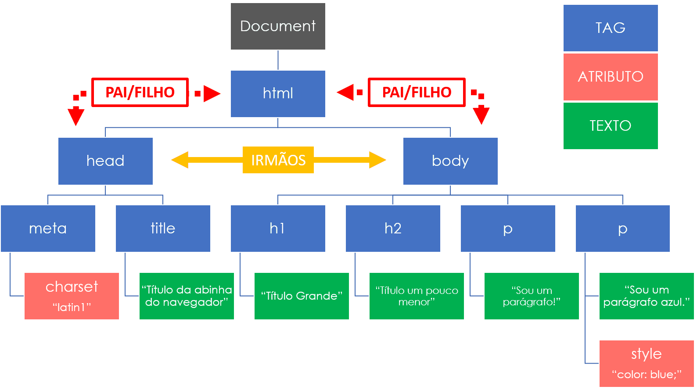
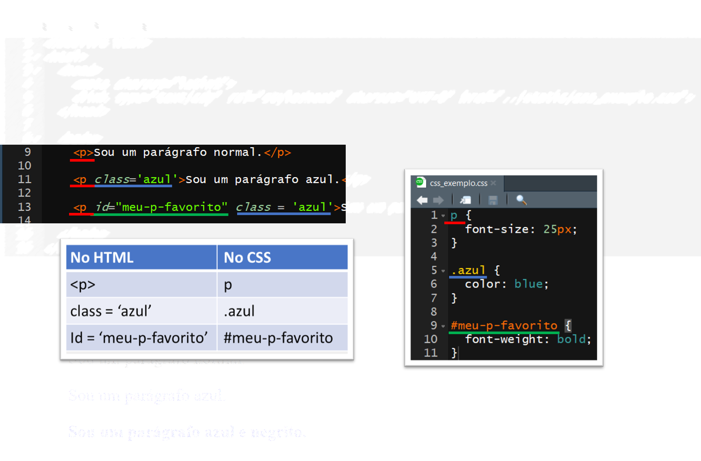
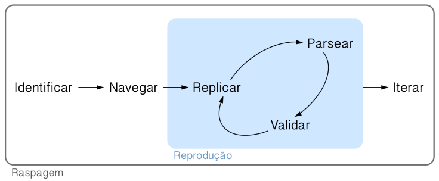
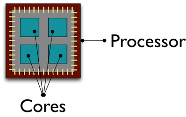

# Fluxo do web scraping

.pull-left[

#### 1. Imitar

- Na aba Network seu navegador, investigue as requisições.
- Tente imitá-las no R, copiando os caminhos e parâmetros utilizados.

#### 2. Coletar

- Baixar todas as páginas HTML (ou outro formato).
- Boa prática: salvar arquivos brutos com `httr::write_disk()`.

]

.pull-right[

#### 3. Parsear

- Transformar os dados brutos em uma base de dados passível de análise.
- Utilizar pacotes `{xml2}`, `{jsonlite}`, `{pdftools}`, dependendo do arquivo.

#### Pacotes

- Utilizar `{httr}` para imitar/coletar.
- Utilizar `{xml2}` para parsear.
- Utilização massiva do `{tidyverse}`.

]

---

# HTML

- HTML (Hypertext Markup Language) é uma linguagem de marcação cujo uso é a criação de páginas web. 

- Por trás de todo site há pelo menos um arquivo .html.

```{r, echo=FALSE}
knitr::include_graphics("img/html1.png")
```

---

# HTML

- Todo arquivo HTML pode ser dividido em seções que definirão diferentes aspectos da página. 
- `<head>` descreve metadados, enquanto `<body>` é o corpo da página.

```{r, echo=FALSE}
knitr::include_graphics("img/html2.png")
```

---

# HTML

- Tags (head, body, h1, p, ...) demarcam as seções e sub-seções

- enquanto atributos (charset, style, ...) mudam como essas seções são renderizadas pelo navegador.

```{r, echo=FALSE}
knitr::include_graphics("img/html3.png")
```

---

# Teoria

1) Todo HTML se transforma em um DOM (document object model) dentro do navegador.

2) Um DOM pode ser representado como uma árvore em que cada node é:

- ou um atributo
- ou um texto
- ou uma tag
- ou um comentário

3) Utiliza-se a relação de pai/filho/irmão entre os nós.

4) Para descrever a estrutura de um DOM, usamos uma linguagem de markup chamada XML (Extensible Markup Language) que define regras para a codificação de um documento.

---

# HTML

O HTML do exemplo, na verdade, é isso aqui:

```{r, echo=FALSE}

```

---

# XPath - XML Path Language

- Exemplo: coletando todas as tags `<p>` (parágrafos)

```{r}
library(xml2)

# Ler o HTML
html <- read_html("img/html_exemplo.html")

# Coletar todos os nodes com a tag <p>
nodes <- xml_find_all(html, "//p")

# Extrair o texto contido em cada um dos nodes
text <- xml_text(nodes)
text
```

---
# XPath - XML Path Language

- Com `xml_attrs()` podemos extrair todos os atributos de um node:

```{r}
xml_attrs(nodes)
xml_attr(nodes, "style")
```

---
# XPath - XML Path Language

- Já com `xml_children()`, `xml_parents()` e `xml_siblings()` podemos acessar a
estrutura de parentesco dos nós:

```{r}
heads <- xml_find_all(html, "head")
xml_siblings(heads)

xml_children(heads)
```

---

# {rvest}

- Pacote construído sobre `{xml2}` e `{httr}`

- Busca facilitar a vida com alguns helpers

- Permite utilização de CSS path, uma alternativa ao XPath

- Na prática, no entanto, pode ser improdutivo utilizá-lo

- No nosso curso, só vamos utilizar a função `rvest::html_table()`, que transforma o conteúdo de  uma tag `<table>` em um `data.frame`.


---
# CSS

- CSS (Cascading Style Sheets) descrevem como os elementos HTML devem se
apresentar na tela. Ele é responsável pela aparência da página.

```{html}
<p style='color: blue;'>Sou um parágrafo azul.</p>
```

- O atributo `style` é uma das maneiras de mexer na aparência utilizando CSS. No
exemplo,

- `color` é uma **property** do CSS e 
- `blue` é um **value** do CSS.

- Para associar esses pares **properties/values** aos elementos de um DOM, existe uma ferramenta chamada **CSS selectors**. Assim como fazemos com XML, podemos usar esses seletores (através do pacote `rvest`) para extrair os nós de uma página HTML.

---
# CSS

- Abaixo vemos um `.html` e um `.css` que é usado para estilizar o primeiro. Se os nós indicados forem encontrados pelos seletores do CSS, então eles sofrerão as mudanças indicadas.

```{r, echo = FALSE, dpi = 240, fig.align='center'}

```

---
# Seletores CSS vs. XPath

- A grande vantagem do XPath é permitir que acessemos os filhos, pais e irmãos de um nó. De fato os seletores CSS são mais simples, mas eles também são mais limitados.

- O bom é que se tivermos os seletores CSS, podemos transformá-los sem muita dificuldade em um query XPath:

- Seletor de tag: `p` = `//p`
- Seletor de classe: `.azul` = `//*[@class='azul']`
- Seletor de id: `#meu-p-favorito` = `//*[@id='meu-p-favorito']`

- Além disso, a maior parte das ferramentas que utilizaremos ao longo do processo trabalham preferencialmente com XPath.

---
# Seletores CSS vs. XPath

```{r}
html <- read_html("img/html_exemplo_css_a_parte.html")
xml_find_all(html, "//p")

xml_find_all(html, "//*[@class='azul']")
```

---
# Seletores CSS vs. XPath

```{r}
rvest::html_nodes(html, ".azul")
```

- Note que `//p` indica que estamos fazendo uma busca na tag `p`, enquanto `//*` indica que estamos fazendo uma busca em qualquer tag.

---

# Exemplos

## Exemplo 06: HTML simples

## Exemplo 07: Chance de gol

## Exemplo 08: Jurisprudência Anatel

---

# Vamos ao R!

```{r, echo=FALSE, fig.align="center"}
knitr::include_graphics("img/cat.gif")
```

---
class: center, middle, inverse

# Iteração

---
# O fluxo do web scraping

- Sempre que fazemos um web scraper é bom seguir um fluxo definido

- Por enquanto já foram apresentados elementos da maior parte do passo-a-passo,
mas nada foi dito sobre a iteração

```{r, echo = FALSE, dpi = 100, fig.align='center', warning=FALSE, message=FALSE}
library(httr)
library(magrittr)
library(purrr)
library(future)
library(furrr)
library(xml2)

```

---
# Por que iterar?

- Dificilmente queremos fazer uma tarefa de web scraping uma vez só (senão
bastaria baixar a página uma vez e raspá-la)

- Podemos querer baixar muitas páginas de uma vez ou uma página a cada certo
tempo

- Iteração, tratamento de erros e automatização passam a ser relevantes

  - O pacote `purrr` nos ajudará a iterar
  
  - O pacote `purrr` retornará para tratar qualquer erro que possa aparecer
  
  - Falaremos de Github Actions na última aula

- Se você estiver interesse em aprender mais, veja nosso curso de 
[Deploy!](https://www.curso-r.com/cursos/deploy/)

---
# Elementos comuns

- **Rodar em paralelo**. Quanto mais rápido, melhor!

- **Rodar com tratamento de erros**. Coisas dão errado no web scraping.

- **Utilizar barras de progresso**. Remédio para ansiedade.

---
# Introdução

- Iteração é um padrão de programação extremamente comum que pode ser altamente
abreviado

```{r}
nums <- 1:10
resp <- c()
for (i in seq_along(nums)) {
  resp <- c(resp, nums[i] + 1)
}
resp
```

```{r, message=FALSE}
library(purrr)
map_dbl(nums, ~.x + 1)
```

---

# A função map

- A função `map()` recebe um vetor ou uma lista de entrada e aplica uma função
em cada elemento do mesmo

- Podemos especificar o formato da saída com a família de funções `map_***()`

- A função pode ser declarada externamente, internamente ou através de um
_lambda_

```{r, eval=FALSE}
soma_um <- function(x) {
  x + 1
}
map(nums, soma_um)
map(nums, function(x) x + 1)
map(nums, ~.x + 1)
```

---
# Utilidade do map

- Se tivermos uma lista de URLs, podemos iterar facilmente em todos sem abrir
mão da sintaxe maravilhosa do Tidyverse

```{r}
urls <- c(
  "https://en.wikipedia.org/wiki/R_language",
  "https://en.wikipedia.org/wiki/Python_(programming_language)"
)
urls |>
  map(read_html) |>
  map(xml_find_first, "//h1") |>
  map_chr(xml_text)
```

---
# Tratando problemas

- Ao repetir uma tarefa múltiplas vezes, não podemos garantir que toda execução
funcione

- O R já possui o `try()` e o `tryCatch()`, mas o `purrr` facilita ainda mais
o trabalho

```{r, error = TRUE}
read_html("https://errado.que")
maybe_read_html <- possibly(read_html, NULL)
maybe_read_html("https://errado.que")
```


---
class: inverse, center, middle

# Paralelismo

---
# O que isso significa?

- Antigamente, computadores eram capazes de executar apenas uma sequência de
comandos por vez

- Avanços tecnológicos permitiram que o processador fosse capaz de fazer
"malabarismo" com diversos processos

- Paralelismo (ou multiprocessamento) chegou apenas com os primeiros _dual-core_

```{r, dpi = 110, fig.align='center', echo=FALSE}

```

---
# Em mais detalhes

- A unidade de processamento central pode ter mais de um **núcleo**
(_multicore_)

- Um **processo** é composto por uma sequência de comandos ou tarefas

- Cada núcleo consegue executar apenas um **comando** por vez

- Os comandos de um processo podem ser interrompidos para que sejam executados
os de outro (_multitasking_)

- O computador pode executar várias tarefas simultaneamente escalonando os
comandos para seus diferentes núcleos (_multithreading_)

- Muitos computadores possuem **núcleos virtuais**, permitindo dois comandos por
vez em cada núcleo (_hyperthreading_)

---
# Exemplo mínimo

O pacote `parallel` já vem instalado junto com o R e consegue rodar comandos
paralelamente tanto no Windows quanto em outros sistemas. Por padrão, ele quebra
a tarefa em 2.

```{r}
library(parallel)
library(tictoc)

tic()
res <- map(1:4, function(x) Sys.sleep(1))
toc()

tic()
res <- mclapply(1:4, function(x) Sys.sleep(1))
toc()
```

---
# Futuros

- O pacote `{future}` expande o pacote `{parallel}`, permitindo o descolamento de tarefas da sessão principal

  - Ele pode operar em 2 níveis: _multicore_ e _multissession_
  
- Em cima do `{future}`, foi construído o `{furrr}` com o objetivo de emular a
sintaxe do `{purrr}` para processamento paralelo

- Diferentemente do `{parallel}`, o `{future}` é capaz de descobrir sozinho o número
de núcleos virtuais do computador

```{r}
library(future)
availableCores()
```

---

# Barras de progresso

- Com o pacote `{progressr}` (recente!), é possível adicionar barras de progresso à suas chamadas, mesmo se a chamada for em paralelo.

```{r}
# coloca o script no contexto
progressr::with_progress({
  
  # cria a barra de progresso
  p <- progressr::progressor(4)
  
  purrr::walk(1:4, ~{
    # dá o passo
    p()
    Sys.sleep(1)
  })
  
})
```

---
# Como faz?

Vamos estabelecer um plano de execução paralela com a função `plan()`. Entender a diferença entre todos os planos disponíveis.

--

```{r, warning=FALSE, message=FALSE}
plan(multisession)
```

- `sequential`: não executa em paralelo, útil para testes

- `multicore`: mais eficiente, não funciona no Windows nem dentro do RStudio

- `multisession`: abre novas sessões do R, mais pesado para o computador

---
# Como faz?

Agora vamos criar uma função que retorna o primeiro parágrafo de uma página da Wikipédia dado o fim de seu URL (como "/wiki/R\_language"). Dicas: textos são denotados pela _tag_ `<p>` em HTML; pule o elemento de classe "mw-empty-elt".

```{r}
download_wiki <- function(url) {
  url |>
    paste0("https://en.wikipedia.org", .) |>
    read_html() |>
    xml_find_first("//p[not(@class='mw-empty-elt')]") |>
    xml_text()
}
```

---
# Como faz?

Executar a função anterior em paralelo para todas as páginas baixadas no
exercício de iteração. Dicas: utilize `future_map()` do pacote `furrr`; não se
esqueça do `possibly()`"!

```{r, warning=FALSE, message=FALSE}
library(furrr)
prgs <- "https://en.wikipedia.org/wiki/R_language" |>
  read_html() |>
  xml_find_all("//table[@class='infobox vevent']//a") |>
  xml_attr("href") |>
  future_map(possibly(download_wiki, ""))
prgs[[3]]
```

```{r, echo=FALSE}
plan(sequential)
```

---

# Exemplos

## Exemplo 08: Jurisprudência Anatel (continuação)

## Exemplo 09: Wiki

## Exemplo 10: Jobs

## Exemplo 11: TJSP (vídeo gravado)

## Exemplo 12: DEJT (extra)

---

# Vamos ao R!

```{r, echo=FALSE, fig.align="center"}
knitr::include_graphics("img/cat.gif")
```
